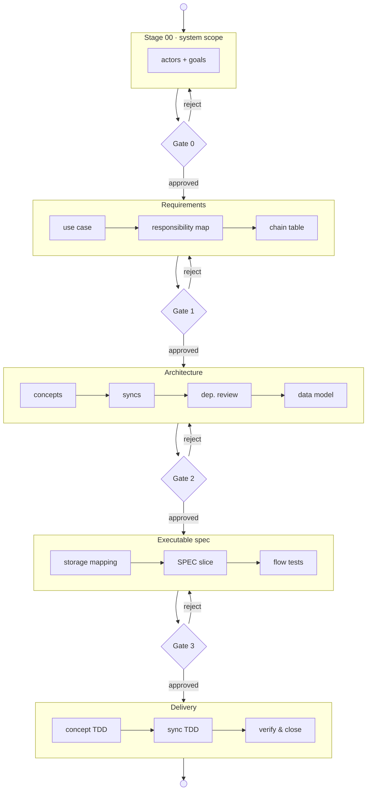

# CLAD — Contract-Led, Artefact-Driven Development

> A starter repository for building software with AI coding agents under a
> discipline that keeps every decision **legible, reviewable, and reversible**.

**TL;DR:** CLAD is a staged, contract-driven workflow that lets one human
reviewer steer a fast AI coding agent — stage by stage, artefact by
artefact — without losing control of the system being built.

CLAD combines three ideas that, taken together, let a single human reviewer
steer multi-step agent work without losing control of the system being built:

1. **CLAD (process)** — every change flows through *contracts* (small,
   reviewable specs) and produces *artefacts* (files on disk you can diff).
   No work happens off-contract; no artefact is born without a contract.
2. **Legible architecture (WYSIWID pattern)** — runtime is decomposed into
   independent **concepts** (small state machines with explicit operational
   principles) connected only by declarative **synchronizations**. What you
   read in a concept spec is what the running system does. Adapted from
   Meng & Jackson, *What You See Is What It Does* (Onward! 2025).
3. **ICM workspace scaffold** — each feature lives in its own folder of
   numbered stages (`01_usecase/`, `02_concepts/`, …). Each stage has a
   `CONTEXT.md` *contract* (Inputs / Process / Outputs) and an `output/`
   folder the human can inspect and edit before the next stage runs.
   Adapted from Van Clief, *Interpretable Context Methodology*.

At every stage there is a folder you can open, a `CONTEXT.md` contract
that tells the agent what to do, and an `output/` folder you can inspect
and edit before the next stage runs. The [state diagram below](#how-clad-works)
shows the full flow; the complete stage table lives in
[`AGENTS.md`](AGENTS.md) §3.

## What makes CLAD different

Most "AI coding" workflows optimise for generating code fast. CLAD
optimises for **keeping a human in control of a fast agent** without
becoming the bottleneck. Concretely:

- **Contracts before code.** Every stage is governed by a `CONTEXT.md`
  that declares its Inputs, Process, and Outputs. The agent cannot work
  off-contract, so its output is predictable and reviewable. See the
  stage-contract template
  [`templates/stage-CONTEXT.md`](templates/stage-CONTEXT.md).
- **Everything is an artefact on disk.** Requirements, concepts, syncs,
  data models, and specs are all files you can `diff`, edit, and revert —
  not hidden chat state. Review happens in your editor, not by re-reading
  a transcript.
- **Legible architecture (WYSIWID).** Runtime is independent concepts
  wired only by declarative syncs. No concept reaches into another, so a
  change's blast radius is local and a single small context window is
  enough to understand any one part. See
  [`methodology/architecture/CONCEPTS.md`](methodology/architecture/CONCEPTS.md).
- **Gate-driven and reversible.** Three human gates per use case (plus a
  collaborative system-scoping gate). A rejected gate sends work back to
  the earliest stage that owns the defect — never an ad-hoc downstream
  patch. See
  [`methodology/implementation/STAGES.md`](methodology/implementation/STAGES.md).
- **Deterministic enforcement, not vibes.** Plain `python3` checks under
  [`quality-gate/`](quality-gate/) verify the artefact chain, and an
  optional [pre-commit hook](quality-gate/install-hooks.sh) refuses
  commits that skip a stage or decouple code from its spec.
- **Model- and framework-agnostic.** The methodology is portable across
  agents (Copilot, Claude, Cursor, Codex, …); only the reference
  implementation profile is language-specific.

## How CLAD works

CLAD is a staged workflow between a human reviewer and an AI coding agent.

- The human provides the brief, reviews artefacts written to disk, and approves work at each gate.
- The agent reads the current stage contract, produces only the allowed artefacts, and stops at the next gate.
- Between gates, the agent can auto-advance through tightly scoped stages and run deterministic checks.
- If a gate fails, work returns to the earliest stage that owns the defect rather than being patched ad hoc downstream.

At a high level, CLAD is a state machine of stages punctuated by human
gates. Between gates the agent auto-advances through tightly scoped
sub-stages; at each gate it stops for review, and a rejection loops back
to the stage that owns the defect:



In other words: one collaborative scoping gate for the system, then three
review gates per use case (Requirements → Architecture → Executable spec)
before the final delivery stages run through to verification. Stage 00
runs once per system brief; stages 01–05 run once per in-scope goal.

## Status

**Public, pre-1.0, and still evolving.** This repo already contains a real
methodology loop, templates, agent guides, a worked example
([`features/UC-00-login/`](features/UC-00-login/README.md)) taken end-to-end
as the canonical example, and an optional runnable Java reference profile
under [`reference-impl/java-micronaut-jena/`](reference-impl/java-micronaut-jena/).
It is usable today as a serious starter, but the methodology is still being
refined and some contracts, templates, and guidance may change between minor
releases.

CLAD the methodology is profile-agnostic. However, this repository currently
ships only one concrete executable implementation profile: a Java 21 +
Micronaut + Apache Jena/TDB2 reference profile using CLAD's sync-engine style
under [`reference-impl/java-micronaut-jena/`](reference-impl/java-micronaut-jena/).
That engine is suitable as a reference implementation and working starter,
but it has not yet been designed or vetted for scale; scaling work remains
future profile-level work.

### Who this is for

- Teams that want strong human review over AI-generated implementation.
- Builders willing to work stage-by-stage and inspect artefacts at gates.
- Projects that benefit from explicit contracts, traceability, and reversible changes.
- Not a fit for "just generate the code" workflows with minimal review discipline.

### Stability and versioning

- CLAD is currently **pre-1.0**.
- Pre-1.0 minor releases may include breaking methodology changes.
- After 1.0, versioning is intended to follow Semantic Versioning more strictly.
- The source of truth is the current repository contracts: [`AGENTS.md`](AGENTS.md),
  [`methodology/README.md`](methodology/README.md), and the active stage
  `CONTEXT.md` files.

### Author

CLAD was created by **Alan Potosnak**. See [`NOTICE`](NOTICE) and
[`methodology/reference/CITATIONS.md`](methodology/reference/CITATIONS.md)
for attribution context and upstream influences.

Important for template users: `reference-impl/` is a seeded **reference
source**, not the main application root for your downstream product. It
holds two kinds of code you must treat differently:

1. **The reusable CLAD engine/runtime** — the `engine/` package
   (`ConceptAgent`/`SyncAgent` base classes, `ActionLog`,
   `SyncDispatcher`, `FlowManager`) plus the ArchUnit rule test. This is
   the **only execution profile shipped today**, and it is infrastructure
   you **copy and reuse as-is** — never reimplement it from scratch.
2. **Example concept and sync code** (the UC-00 login classes) — these
   you replace with your own concepts and syncs as you work the stages.

If you adopt this profile, copy the **whole** profile — engine
included — into your own project root or runtime folder (`app/`,
`backend/`, `services/api/`, etc.) and set your real package and source
roots in
[`templates/feature-skeleton/_config/package-and-layout.md`](templates/feature-skeleton/_config/package-and-layout.md).
Do not keep extending `reference-impl/` in place with product-specific
code, and do not ask the agent to re-create the engine when it already
exists here.

## Quick start

> **Using this as a starter for your own project?** Click **"Use this
> template"** at the top of the GitHub repo (or
> [follow this link](https://github.com/abratto/clad/generate)) to get
> a clean copy with no fork relationship — then read on.

When you later implement against a concrete profile, copy the **whole**
profile out of `reference-impl/` into your own project root: the CLAD
engine/runtime is reusable infrastructure you copy **as-is** (it is the
only execution profile that exists today), while only the example
concepts and syncs are meant to be replaced. Your real application code
should live under your own chosen project root, not inside the starter's
`reference-impl/` tree — and the agent should reuse the shipped engine
rather than reimplement it. The exact copy-out command and package/
source-root setup are in
[`reference-impl/java-micronaut-jena/README.md`](reference-impl/java-micronaut-jena/README.md).

### Requirements

CLAD itself is mostly a repository of methodology, templates, and stage
contracts, so the required stack depends on how far you want to go:

- **To use CLAD as a methodology starter:** Git, a code editor, and an AI
  coding agent/chat client are enough to read the contracts and begin Stage 00.
- **To run CLAD's deterministic quality-gate scripts:** Python 3 is required.
  The scripts under [`quality-gate/`](quality-gate/) are plain `python3`
  command-line checks.
- **To run the optional Java reference profile:** Java 21 and Maven are
  required. The concrete Java stack is documented in
  [`reference-impl/java-micronaut-jena/README.md`](reference-impl/java-micronaut-jena/README.md).

At the moment, this Java/Micronaut/Jena/TDB2 profile is the only runnable
implementation profile shipped with the repository.
It is a working reference profile, not a claim that the current engine has
already been designed or validated for production scale.

If you are only evaluating the workflow, you do **not** need Java or Maven
to start using CLAD.

```bash
git clone https://github.com/abratto/clad.git
cd clad
# Read in this order:
#   1. README.md (you are here)
#   2. AGENTS.md                       ← canonical guide for any AI coding agent
#   3. methodology/README.md           ← reading order for the methodology
#   4. methodology/WALKTHROUGH.md      ← annotated UC-00 session, turn by turn
#   5. features/UC-00-login/README.md  ← the worked example itself
```

**Recommended one-time setup.** Activate the opt-in stage-sequence hook so
`git commit` refuses commits that skip a CLAD stage or decouple code from
its spec:

```bash
./quality-gate/install-hooks.sh   # sets core.hooksPath; bypass with git commit --no-verify
```

The hook is optional (git never runs hooks from a fresh clone) but strongly
recommended — see
[`methodology/implementation/QUALITY_GATE.md`](methodology/implementation/QUALITY_GATE.md)
§"Installing the local pre-commit hook".

Getting started is really **two prompts** — `AGENTS.md` handles the
rest. It tells the agent to load the workspace context automatically,
routes a plain-language brief into Stage 00, and drives the stage-to-gate
loop without further scripting from you.

#### Step 1 — load the rules

After cloning, open a chat with your agent (Copilot, Claude, Cursor,
Codex, …) in this workspace and send:

> Read `AGENTS.md` in full and follow it, then wait for my brief.

`AGENTS.md` is self-bootstrapping: following it makes the agent load the
workspace router (`CONTEXT.md`) and the methodology on its own. If you
want to see a full turn-by-turn example first, skim
[`methodology/WALKTHROUGH.md`](methodology/WALKTHROUGH.md) yourself.

#### Step 2 — give your brief

Just describe what you want to build in plain language and ask the agent
to start system scoping:

> I want to build *<one paragraph describing what you want the system to
> let users do>*. Run system-scope Stage 00 for this.

The agent will run **Stage 00 (actor/goal)** at system scope: propose
actors and goals, ask up to five clarifying questions, and wait for your
approval before writing any artefact.

<details>
<summary>Worked example brief — a library lending system (click to expand)</summary>

> I want to build a library lending system. The system should prioritize
> ease of access and self-sufficiency for patrons while supporting branch
> staff operations needed to keep lending reliable. The system must
> provide a unified digital portal where patrons can browse the full
> catalog in real time, view item availability by branch, and manage
> their own account. Patrons must be able to place holds, renew eligible
> loans, view due dates, and receive automated reminders by email or SMS.
> Branch staff must be able to manage hold fulfillment and
> check-in/check-out status so patron-facing availability remains
> accurate. For this initial scope, include lending and hold workflows;
> exclude acquisitions, catalog metadata editing, and interlibrary loan.
> Treat patron self-service lending as P0; assume no fixed external API
> contract unless one is provided. Run system-scope Stage 00 for this.

To adapt this for your own project, keep the structure (actors, core
capabilities, explicit in-scope/out-of-scope, priority hint, contract
assumption) and replace only the domain details.

</details>

#### From there on — the agent drives

Once you approve Stage 00, you stop scripting prompts. The agent creates
one `features/UC-XX-<slug>/` folder per in-scope goal and walks each
feature through stages 01–05, pausing only at the three human gates
(Requirements, Architecture, Executable spec). Your job is to review and
approve — or reject, which loops work back to the stage that owns the
defect. Steer in plain language: "what's next", "let's do UC-02", "redo
the syncs". See the intent-routing and advance rules in
[`AGENTS.md`](AGENTS.md) §2.

### Configuration

Edit [`clad.properties`](clad.properties) at the repo root to set your
project's global defaults. The file is committed and works with any
agent framework (Cline, Copilot, Cursor, Roo, Codex, …).

```properties
# The single command that runs the full test suite.
test.command=mvn test

# Describe your persistence technology (used by the Stage 04a storage mapping).
storage.layer=Jena TDB2 named graph (Java/Micronaut profile)
```

Outer flow tests at Stage 04c use Cucumber/BDD (Gherkin `.feature` files
+ step definitions) — see
[methodology/architecture/GHERKIN_INTEGRATION.md](methodology/architecture/GHERKIN_INTEGRATION.md).
The Java reference profile ships a Cucumber integration; build and test
with a single `mvn test` that runs concept unit tests, sync integration
tests, and BDD flow tests together.

If you plan to adopt the Java reference profile, read
[`reference-impl/java-micronaut-jena/README.md`](reference-impl/java-micronaut-jena/README.md)
after Stage 00 passes and before Stage 04 implementation work. That file
shows how to copy the starter profile into your real app root, how to run
it locally, and how the Java package/source-root conventions map back into
`_config/package-and-layout.md`. The Java profile ships a Cucumber
integration; build and test with a single `mvn test` that runs concept
unit tests, sync integration tests, and BDD flow tests together (see
[methodology/architecture/GHERKIN_INTEGRATION.md](methodology/architecture/GHERKIN_INTEGRATION.md)).

If you want to sequence multiple goals before implementation, adopt the
optional planning overlay:

- [methodology/overlays/PLANNING.md](methodology/overlays/PLANNING.md)
- [templates/plan-board.md](templates/plan-board.md)

## Where this comes from

CLAD emerged from a private project (Tastetag) built on Meng & Jackson's
WYSIWID architecture (Onward! 2025) and structured with Van Clief's ICM
workspace (2026). The origin story, design influences, and what CLAD
adds on top of both are covered in detail in
[`methodology/ORIGINS.md`](methodology/ORIGINS.md).

### Agent platform integration

CLAD is framework-agnostic. `AGENTS.md` is the canonical instruction source
for Copilot, Cline, Cursor, and other agents. What changes by tool is only
the local wiring — the process contract is shared.

Platforms that support the [agentskills.io](https://agentskills.io) standard
(Claude Code, Copilot, Cursor, OpenCode, Gemini CLI, and 30+ others) will
automatically discover CLAD skills from the `skills/` directory. Skills
provide on-demand domain expertise via progressive disclosure — the agent
loads only the skill relevant to the current stage.

The gate model (AGENTS.md §6) and stage CONTEXT.md contracts govern
behaviour regardless of platform. No platform-specific rule files or
mode toggles are required.

## Repository layout

```
clad/
├── README.md
├── LICENSE                          Apache-2.0
├── NOTICE                           Third-party attributions
├── SECURITY.md                      Vulnerability reporting policy
├── CHANGELOG.md                     Per-version changes
├── ROADMAP.md                       Optional tracking overlay (CI-checked)
├── CONTRIBUTING.md
├── AGENTS.md                        Canonical agent guide (single source)
├── CLAUDE.md                        Adapter -> AGENTS.md
├── .github/copilot-instructions.md  Adapter -> AGENTS.md
├── .cursor/rules/clad.mdc           Adapter -> AGENTS.md
├── clad.properties                  Project-wide settings (any agent framework)
├── skills/                            Portable agent skills (agentskills.io standard)
├── .clineignore                       Cline automatic-context exclusions
├── CONTEXT.md                         Workspace routing (ICM Layer 1)
│
├── methodology/
│   ├── README.md                    Reading order
│   ├── WALKTHROUGH.md               Annotated UC-00 session (turn by turn)
│   ├── core/                        CLAD: contracts, artefacts, principles
│   ├── architecture/                Legible/WYSIWID + ARTEFACT_MAP.md
│   ├── implementation/              Hard rules + ICM stage mapping
│   ├── overlays/                    Optional: tracking, planning, decision logs
│   └── reference/                   Citations and source pointers
│
├── templates/                       Per-artefact templates +
│   ├── feature.feature              Gherkin feature file (Cucumber/BDD track)
│   ├── step-definitions.java        Step-definition skeleton (Cucumber/BDD track)
│   ├── plan-board.md                Optional sequencing board for overlays/PLANNING
│   └── feature-skeleton/            ...empty stage tree to copy for new features
│
├── features/
│   ├── README.md
│   ├── _system/                     System-level Stage 00 (actors.md, goals.md)
│   │   └── stages/00_actor-goal/    Run once per project brief
│   └── UC-00-login/                 Worked example (read, do not copy)
│       ├── README.md                Stage-by-stage index with rationale
│       ├── _config/                 Feature-scoped reference (Layer 3)
│       └── stages/
│           ├── 00_actor-goal/
│           ├── 01_usecase/
│           ├── 02a_responsibility-map/
│           ├── 02b_chain-table/
│           ├── 02_concepts/
│           ├── 03_syncs/
│           ├── 03a_dependency-review/
│           ├── 03b_data-model/
│           ├── 04_implement/        Router + 04a_storage-mapping, 04b_spec,
│           │                        04c_flow-tests, 04d_concept-tdd
│           │                        (04d_red-tests, 04d_green-impl),
│           │                        04e_sync-tdd (04e_red-tests,
│           │                        04e_green-impl)
│           └── 05_verify/
│
└── reference-impl/
    └── java-micronaut-jena/         Optional Java profile (skeleton)
```

## License

Apache License 2.0. See [LICENSE](LICENSE) and [NOTICE](NOTICE).

## Citations

- Meng, E. & Jackson, D. (2025). *What You See Is What It Does: A Structural
  Pattern for Legible Software.* Onward! 2025.
  [DOI 10.1145/3759429.3762628](https://doi.org/10.1145/3759429.3762628) ·
  [arXiv 2508.14511](https://arxiv.org/abs/2508.14511)
- Van Clief, J. (2026). *Interpretable Context Methodology (ICM).*
  [arXiv 2603.16021](https://arxiv.org/abs/2603.16021) ·
  [github.com/RinDig/Interpretable-Context-Methodology-ICM-](https://github.com/RinDig/Interpretable-Context-Methodology-ICM-)
