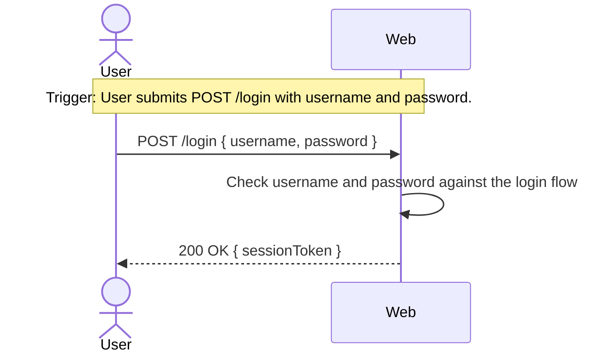

# UC-00 — Login

## Completeness level

- [x] **Fully Dressed** — promoted at the start of Stage 02a (the
  feature is in active design).

## Operational principle

A registered user opens the login page, enters their username and
password, and submits. If the credentials match a registered user
and the account is not locked, a session is opened and the user is
redirected to their landing page; on subsequent requests the session
identifies them. If the credentials do not match, an error message
is shown and they may try again, up to a small number of attempts
before the account is locked.

## Actors

- **User** — a registered account holder attempting to authenticate.

## Scenarios

### Scenario: successful-login

- **Pre-conditions:**
  - A registered `User` with that username exists.
  - That user has registered a password credential with `PasswordAuth`.
  - The account is not in a `Locked` state.
- **Main flow:**
  1. The User submits `POST /login` with `{ username, password }`.
  2. `Web` invokes `User.lookupByUsername(username)`, which returns
     `Found(userId)`.
  3. `Web` invokes `PasswordAuth.check(userId, password)`, which
     returns `Ok`.
    4. The `WhenPasswordAuthCheckOkThenSessionGrantForLogin` sync fires, invoking
      `Session.grant(userId)` which returns `Granted(sessionId)`.
    5. The `WhenSessionGrantGrantedThenWebRespondForLogin` sync fires, returning `200` with
      `{ sessionToken: sessionId }`.
- **Expected outcomes:**
  - A new `Session` is opened for the user.
  - The response carries a session token.
  - Subsequent requests bearing that token are recognised as the user.
- **Postconditions — Success:**
  - `Session` has one new active row keyed by the returned
    `sessionId`, owned by `userId`.
  - `PasswordAuth`'s failed-attempt counter for `userId` is reset
    (or, if not yet implemented, unchanged from zero).
  - `User`'s named region is unchanged.
- **Postconditions — Failure:**
  - Not applicable — this scenario is the success branch. Failures
    are covered by the *wrong-password*, *unknown-user*, and
    *lockout* scenarios below.
- **Interaction sketch (optional):**

### Scenario: wrong-password

- **Pre-conditions:**
  - A registered `User` with that username exists.
  - The account is not yet at the lockout threshold.
- **Main flow:**
  1. The User submits `POST /login` with `{ username, password }`.
  2. `Web` invokes `User.lookupByUsername(username)`, which returns
     `Found(userId)`.
  3. `Web` invokes `PasswordAuth.check(userId, password)`, which
     returns `BadPassword`.
  4. `Web` responds `401` with the opaque error message.
- **Expected outcomes:**
  - No session is opened.
  - The response shows: *"Username or password didn't match."*
  - The failed-attempt counter for that user increments.
- **Postconditions — Success:**
  - Not applicable — this is a failure scenario.
- **Postconditions — Failure:**
  - `Session`'s named region is unchanged.
  - `PasswordAuth`'s failed-attempt counter for `userId` is
    incremented by 1.
  - `User`'s named region is unchanged.

### Scenario: unknown-user

- **Pre-conditions:**
  - No registered `User` with that username exists.
- **Main flow:**
  1. The User submits `POST /login` with `{ username, password }`.
  2. `Web` invokes `User.lookupByUsername(username)`, which returns
     `NotFound`.
  3. `Web` responds `401` with the same opaque error message used by
     *wrong-password* (no enumeration leak).
- **Expected outcomes:**
  - No session is opened.
  - The response shows the same message as *wrong-password* (no
    enumeration leak).
- **Postconditions — Success:**
  - Not applicable.
- **Postconditions — Failure:**
  - **No state is modified** in any concept. In particular, no
    `PasswordAuth` row is created and no counter is incremented for
    the unknown username (counters key on `userId`, which does not
    exist for an unknown username).

### Scenario: lockout

- **Pre-conditions:**
  - A registered `User` with that username exists.
  - That user's failed-attempt counter has reached the lockout
    threshold within the lockout window.
- **Main flow:**
  1. The User submits `POST /login` with `{ username, password }`.
  2. `Web` invokes `User.lookupByUsername(username)`, which returns
     `Found(userId)`.
    3. `Web` invokes `PasswordAuth.check(userId, password)`, which
      returns `Locked`.
    4. The `WhenPasswordAuthCheckLockedThenWebRespondForLogin` sync fires, returning `401` with the
      lockout message.
- **Expected outcomes:**
  - No session is opened.
  - The response shows: *"Too many attempts. Try again in 15 minutes."*
  - This holds even if the credentials supplied are correct.
- **Postconditions — Success:**
  - Not applicable.
- **Postconditions — Failure:**
  - `Session`'s named region is unchanged.
  - `PasswordAuth`'s `lockedUntil[userId]` remains in force for the
    lockout window.
  - `User`'s named region is unchanged.

## Out of scope

- Account registration (separate use case).
- Password reset.
- Multi-factor authentication.
- Single sign-on.
- Email-based identity (UC-00 uses opaque usernames).
- Logout (separate use case; would close the session).

## Relationship to other use cases

- **UC-XX — Registration** *(future)* — produces the `User` and
  `PasswordAuth` rows that this use case authenticates against.
- **UC-XX — Logout** *(future)* — closes a `Session` row produced by
  the *successful-login* scenario.
- **UC-XX — Password reset** *(future)* — would be the first use
  case to need a Pattern D read of `User.email`, expanding `User`'s
  exposed state.
