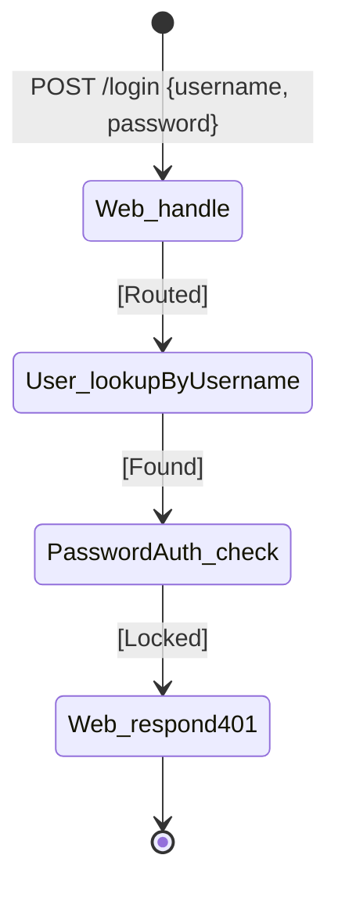

# Chain table — `lockout`

## Scenario

`lockout` — `POST /login` after the failed-attempt counter has
reached the lockout threshold for that user.

## Chain

| # | When | Then | Inputs | Outcome | Why this step |
|---|---|---|---|---|---|
| 1 | `Web/request[POST /login]` | `Web.handle` | `POST /login`, `{ username, password }` | `Routed` | Sole HTTP entry (R4) |
| 2 | `Web.handle[Routed]` | `User.lookupByUsername` | `username` | `Found(userId)` | The username exists |
| 3 | `User.lookupByUsername[Found(userId)]` | `PasswordAuth.check` | `userId`, `password` | `Locked` | Counter is at threshold; verifier short-circuits regardless of password |
| 4 | `PasswordAuth.check[Locked]` | `Web.respond[401]` | `401`, `{ message: "Too many attempts. Try again in 15 minutes." }` | `Sent` | Distinct message — the lockout state is observable to the user |

## Diagram

## Cross-checks

- `Web`, `User`, `PasswordAuth` are listed in the responsibility map
  and `lockout` lists all three under *Coverage check*.
- The `Locked` outcome is short-circuiting: even a correct password
  yields `Locked`, per `01_usecase/output/usecase.md` §`lockout`.
- The lockout message text differs from `wrong-password` /
  `unknown-user` — the lockout state is intentionally visible.

## Notes

- The counter increment that *causes* the lockout is part of
  `PasswordAuth.check`'s `BadPassword` outcome (see the
  `wrong-password` chain). The `lockout` chain shows what happens on
  the *next* attempt, once the counter is already at threshold.
- The lockout branch is represented directly by the `Locked` outcome on
  `PasswordAuth.check` plus the `WhenPasswordAuthCheckLockedThenWebRespondForLogin` sync.
