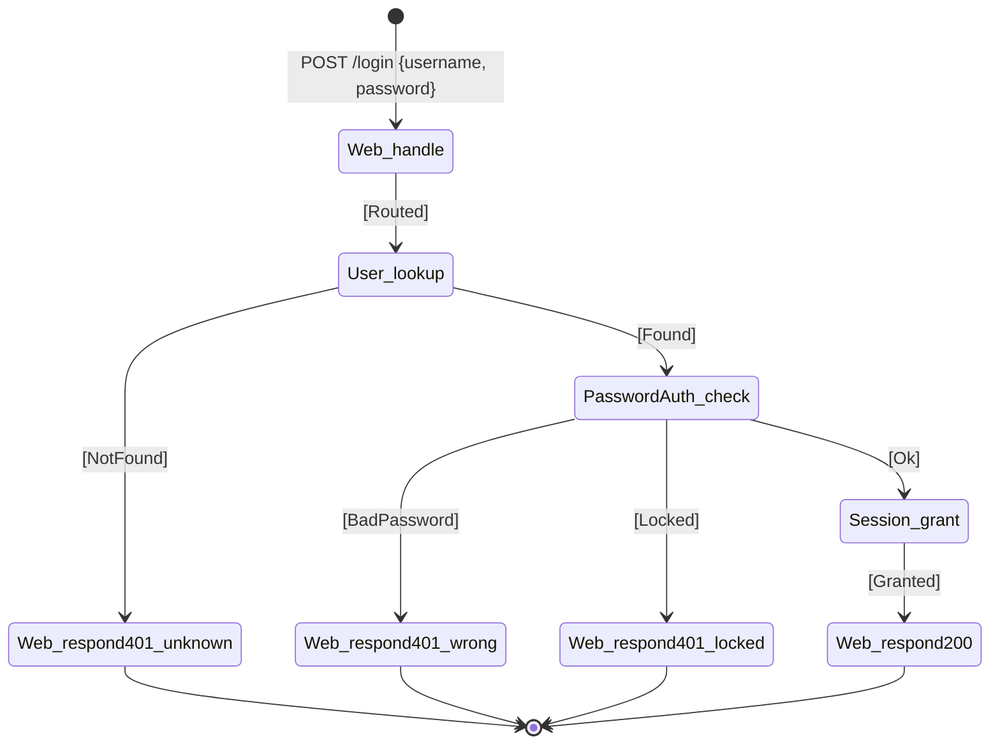

# Consolidated chain — `login` (all scenarios)

> **Status: Derived, non-canonical view.** This file consolidates all four UC-00-login scenarios into a single branching chain and combined FSM diagram. It shows every possible transition and outcome in one view, aiding implementation review (Stages 03–04) by making complete outcome coverage visible. The four per-scenario files (`successful-login-chain.md`, `wrong-password-chain.md`, `lockout-chain.md`, `unknown-user-chain.md`) remain canonical for traceability to the use case.

## WYSIWID lineage and Stage 03 boundary

This artefact remains a **Stage 02b causal chain**, not a sync spec:

- `Then` is the concrete rendering of the Level 2b **Then**.
- `When` is explicit in each row so the causal edge is reviewable directly.
- `Inputs` show the downstream action's arguments only. They do **not** encode Stage 03 `Where` provenance.
- Stage 03 is where CLAD first adds join provenance, pattern labels, and sync names.

## Scenarios covered

- `successful-login` (main flow — valid credentials, fresh session)
- `wrong-password` (error — username exists, password mismatch)
- `lockout` (error — username exists, account locked after threshold)
- `unknown-user` (error — username does not exist)

## Consolidated chain

| # | Scenario(s) | When | Then | Inputs | Outcome | Why this path |
|---|---|---|---|---|---|---|
| 1 | all | `Web/request[POST /login]` | `Web.handle` | `POST /login`, `{ username, password }` | `Routed` | Sole HTTP entry (R4) |
| 2 | all | `Web.handle[Routed]` | `User.lookupByUsername` | `username` | `Found(userId)` \| `NotFound` | Determine if user is registered |
| 3a | unknown-user | `User.lookupByUsername[NotFound]` | `Web.respond[401]` | `401`, `{ message: "username or password didn't match" }` | `Sent` | No such user; opaque message (no enumeration leak) |
| 3b | successful-login, wrong-password, lockout | `User.lookupByUsername[Found(userId)]` | `PasswordAuth.check` | `userId`, `password` | `Ok` \| `BadPassword` \| `Locked` | Verify credential; increment counter if needed |
| 4a | successful-login | `PasswordAuth.check[Ok]` | `Session.grant` | `userId` | `Granted(sessionId)` | Open session for verified user |
| 4b | wrong-password | `PasswordAuth.check[BadPassword]` | `Web.respond[401]` | `401`, `{ message: "username or password didn't match" }` | `Sent` | Wrong password (counter incremented internally); same opaque message |
| 4c | lockout | `PasswordAuth.check[Locked]` | `Web.respond[401]` | `401`, `{ message: "Too many attempts. Try again in 15 minutes." }` | `Sent` | Lockout state is observable to user; distinct message |
| 5 | successful-login | `Session.grant[Granted(sessionId)]` | `Web.respond[200]` | `200`, `{ sessionToken: sessionId }` | `Sent` | Closes request with new token |

## Concept outcome enums (derived from all scenarios)

These are the complete set of outcomes each concept can emit in this use case:

- **`Web.handle`**: `[Routed]`
- **`User.lookupByUsername`**: `[Found(userId), NotFound]`
- **`PasswordAuth.check`**: `[Ok, BadPassword, Locked]`
- **`Session.grant`**: `[Granted(sessionId)]`
- **`Web.respond`**: `[Sent]`

## State diagram (combined FSM)

## Implementation coverage checklist

Use this when implementing Stages 03–04 to verify no outcome is missed:

### Concept outcome enums

- [ ] `User.lookupByUsername`: `[Found, NotFound]` ✓ all two outcomes in table
- [ ] `PasswordAuth.check`: `[Ok, BadPassword, Locked]` ✓ all three outcomes in table
- [ ] `Session.grant`: `[Granted]` ✓ single outcome in table
- [ ] `Web.handle`: `[Routed]` ✓ single outcome in table

### Sync rules (Stage 03)

- [ ] One sync per non-root row ✓ count = 7 non-root rows = 7 syncs
  - [ ] `Web_handle[Routed] → User_lookup`
  - [ ] `User_lookup[Found] → PasswordAuth_check`
  - [ ] `User_lookup[NotFound] → Web_respond[401]`
  - [ ] `PasswordAuth_check[Ok] → Session_grant`
  - [ ] `PasswordAuth_check[BadPassword] → Web_respond[401]`
  - [ ] `PasswordAuth_check[Locked] → Web_respond[401]`
  - [ ] `Session_grant[Granted] → Web_respond[200]`
- [ ] All error syncs present (rows 3a, 4b, 4c)
- [ ] No invented outcomes used in syncs

### Flow tests (Stage 04c)

- [ ] One test per terminal outcome:
  - [ ] `test_successful_login` — exercises row 1→2→3b→4a→5, expects 200
  - [ ] `test_wrong_password` — exercises row 1→2→3b→4b, expects 401
  - [ ] `test_lockout` — exercises row 1→2→3b→4c, expects 401
  - [ ] `test_unknown_user` — exercises row 1→2→3a, expects 401
- [ ] Total: 4 tests ✓ one per distinct terminal state

## Cross-check against per-scenario files

- ✓ Row 1 (Web.handle) appears in all four per-scenario files
- ✓ Row 2 (User.lookupByUsername) appears in all four per-scenario files
- ✓ Row 3a (unknown-user → 401) traces to `unknown-user-chain.md` steps 2–3
- ✓ Row 3b (PasswordAuth.check) traces to steps 3 in `successful-login`, `wrong-password`, `lockout` chains
- ✓ Row 4a (Session.grant) traces to `successful-login-chain.md` step 4
- ✓ Row 4b (wrong-password → 401) traces to `wrong-password-chain.md` step 4
- ✓ Row 4c (lockout → 401) traces to `lockout-chain.md` step 4
- ✓ Row 5 (successful-login → 200) traces to `successful-login-chain.md` step 5
- ✓ All outcome enums match across files (PasswordAuth.check always `[Ok, BadPassword, Locked]`)

## Deriving syncs from this table (Stage 03)

Row 1 is the root `Web.handle` entry; it is not itself a sync.

For each non-root row's derived `When -> Then` transition:

2. **Row 1→2:** When `Web.handle[Routed]`, invoke `User.lookupByUsername` → sync name: `WhenWebHandleRoutedThenUserLookupByUsernameForLogin`
3. **Row 2 [Found] → 3b:** When `User.lookupByUsername[Found(userId)]`, invoke `PasswordAuth.check` → sync: `WhenUserLookupByUsernameFoundThenPasswordAuthCheckForLogin`
4. **Row 2 [Refused] → 3a:** When `User.lookupByUsername[Refused]`, invoke `Web.respond[401]` → sync: `WhenUserLookupByUsernameRefusedThenWebRespondForLogin`
5. **Row 3b [Ok] → 4a:** When `PasswordAuth.check[Ok]`, invoke `Session.grant` → sync: `WhenPasswordAuthCheckOkThenSessionGrantForLogin`
6. **Row 3b [BadPassword] → 4b:** When `PasswordAuth.check[BadPassword]`, invoke `Web.respond[401]` → sync: `WhenPasswordAuthCheckBadPasswordThenWebRespondForLogin`
7. **Row 3b [Locked] → 4c:** When `PasswordAuth.check[Locked]`, invoke `Web.respond[401]` → sync: `WhenPasswordAuthCheckLockedThenWebRespondForLogin`
8. **Row 4a [Granted] → 5:** When `Session.grant[Granted(sessionId)]`, invoke `Web.respond[200]` → sync: `WhenSessionGrantGrantedThenWebRespondForLogin`
