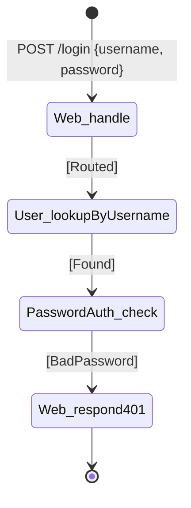

# Chain table — `wrong-password`

## Scenario

`wrong-password` — `POST /login` with a username that exists but a
password that does not match. Account is below the lockout threshold.

## Chain

| # | When | Then | Inputs | Outcome | Why this step |
|---|---|---|---|---|---|
| 1 | `Web/request[POST /login]` | `Web.handle` | `POST /login`, `{ username, password }` | `Routed` | Sole HTTP entry (R4) |
| 2 | `Web.handle[Routed]` | `User.lookupByUsername` | `username` | `Found(userId)` | The username does exist |
| 3 | `User.lookupByUsername[Found(userId)]` | `PasswordAuth.check` | `userId`, `password` | `BadPassword` | Credential mismatch; counter increments inside `PasswordAuth` |
| 4 | `PasswordAuth.check[BadPassword]` | `Web.respond[401]` | `401`, `{ message: "username or password didn't match" }` | `Sent` | Same opaque message as `unknown-user` (no enumeration leak) |

## Diagram

## Cross-checks

- `Web`, `User`, `PasswordAuth` are listed in the responsibility map
  and `wrong-password` lists all three under *Coverage check*.
- No `Session.grant` row, because no session is opened.
- Failed-attempt counting is an *internal* state effect of
  `PasswordAuth.check`'s `BadPassword` outcome — it does not appear
  as a separate row.

## Notes

- The `BadPassword` outcome is the one Stage 03 will branch on
  (one sync writes the 401 response). The actual lockout transition
  is the `lockout` scenario.
