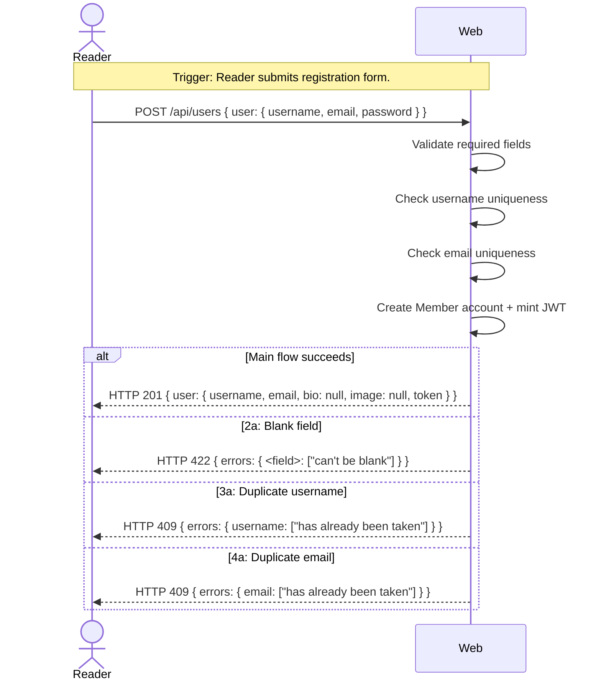

# UC-01 — Register Account

## Completeness level

- [ ] **Brief**
- [ ] **Casual**
- [x] **Fully Dressed** — mandatory Postconditions for every scenario.

## Operational principle

A Reader who wants to become a Member submits their chosen username, email address, and password. The system validates the input (no blank fields), checks that the username and email are not already taken, creates the account, and returns a JSON Web Token that the new Member can use for subsequent requests. If the input is invalid or the username/email is already registered, the system returns an appropriate error code and message — no account is created.

## Actors

- **Reader** — anyone who wants to become a Member by registering an account

## Scenarios

### Scenario: register-account

- **Trigger:** Reader submits the registration form with username, email, and password.
- **Pre-conditions:**
  - No authenticated session exists for this Reader.
  - The username is not already taken.
  - The email is not already taken.
- **Main flow:**
  1. Reader sends username, email, and password to the system.
  2. System validates that all required fields are present and non-empty.
  3. System checks that the username is unique.
  4. System checks that the email is unique.
  5. System creates the Member account (hashed password, profile with null bio and null image).
  6. System generates a JWT session token for the new Member.
  7. System responds with HTTP 201 and the user object (username, email, bio, image, token).
- **Expected outcomes:**
  - A new Member account exists in the system.
  - The response includes a valid JWT token.
  - `bio` and `image` are `null` in the response.
- **Postconditions — Success:**
  - A new `User` entity is persisted with the submitted username, email, and a hashed password. Bio and image are stored as `null`.
  - A `Session` entity is created linking the new Member to a JWT token.
  - The username and email are now in use and will be rejected if another registration attempts them.
- **Postconditions — Failure:**
  - If the flow terminates at any extension below, **no state is modified**. No `User` entity is created and no `Session` is minted.

- **Extensions:**
  - **2a.** Required field is blank (username, email, or password empty):
      1. System identifies the blank field(s).
      2. System responds with HTTP 422 and error body `{"errors": {"<field>": ["can't be blank"]}}`.
      - Postconditions — Success: N/A (extension terminates in failure).
      - Postconditions — Failure: No state is modified.
  - **3a.** Username is already taken:
      1. System detects the duplicate username.
      2. System responds with HTTP 409 and error body `{"errors": {"username": ["has already been taken"]}}`.
      - Postconditions — Success: N/A (extension terminates in failure).
      - Postconditions — Failure: No state is modified.
  - **4a.** Email is already taken:
      1. System detects the duplicate email.
      2. System responds with HTTP 409 and error body `{"errors": {"email": ["has already been taken"]}}`.
      - Postconditions — Success: N/A (extension terminates in failure).
      - Postconditions — Failure: No state is modified.

- **Interaction sketch:**

## Out of scope

- Email verification / account confirmation — the Conduit spec does not require email verification.
- Password strength validation beyond non-empty — the spec tests accept passwords of any length ≥ 1 character.
- User roles or permissions during registration — roles are not part of the Conduit API.

## Relationship to other use cases

- **UC-02-sign-in** — Sign In depends on the account created by this use case.
- **UC-03-manage-profile** — Manage Profile depends on an existing registered account.
