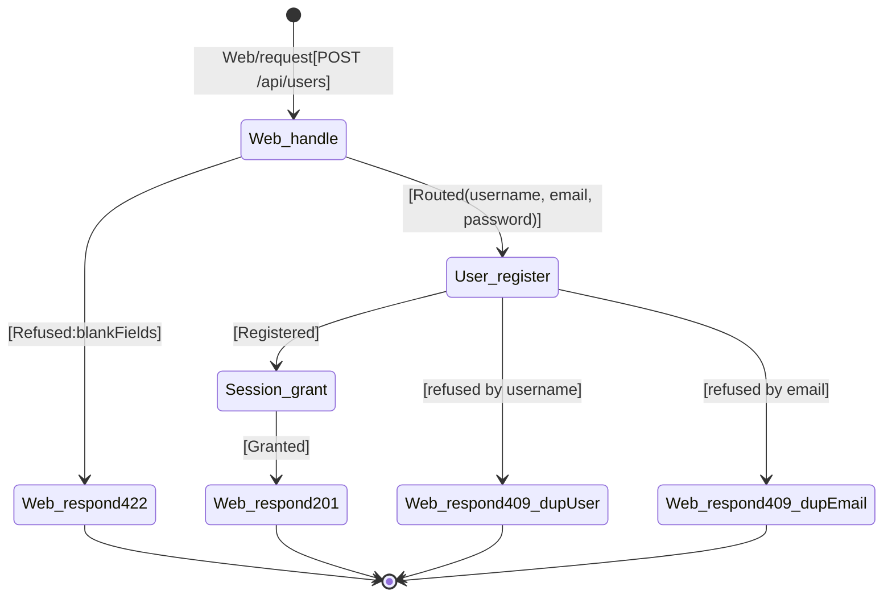

# Chain table — register-account

## Scenario

`register-account` — Reader submits the registration form with username, email, and password.

## Chain

| # | When | Then | Inputs | Outcome | Why this step |
|---|---|---|---|---|---|---|
| 1 | `Web/request[POST /api/users]` | `Web.handle` | route, body `{username, email, password}` | `Routed(username, email, password)` \| `Refused:blankFields` | HTTP entry point (R4); validates request body is parseable and required fields present. |
| 2 | `Web.handle[Refused:blankFields]` | `Web.respond[422]` | `{errors: {<field>: ["can't be blank"]}}` | `Sent` | Blank field detected — return validation error. |
| 3 | `Web.handle[Routed(username, email, password)]` | `User.register` | username, email, password | `Registered` \| `refused` | Create user record after verifying username and email uniqueness. Precondition failure means username or email is taken. |
| 4 | `User.register[Registered]` | `Session.grant` | userId | `Granted` | Mint a JWT session token for the newly registered user so they can authenticate immediately. |
| 5a | `User.register[refused]` | `Web.respond[409]` | `{errors: {username: ["has already been taken"]}}` | `Sent` | Precondition failure — username already exists. |
| 5b | `User.register[refused]` | `Web.respond[409]` | `{errors: {email: ["has already been taken"]}}` | `Sent` | Precondition failure — email already exists. |
| 6 | `Session.grant[Granted]` | `Web.respond[201]` | `{user: {username, email, bio: null, image: null, token}}` | `Sent` | Return success response with user object and JWT token. |

## Diagram

## Cross-checks

- Every concept in the table (`Web`, `User`, `Session`) is listed in `../02a_responsibility-map/output/responsibility-map.md`.
- The first row is `Web/request → Web.handle` (R4); the last rows are `... → Web.respond[...]`.
- The trigger (`POST /api/users`) and final response (201 with user + token, 409 with error) match the use case's Trigger and Expected outcomes.
- Extension 2a (blank field) is handled by `Web.handle` itself before emitting `Routed`.
- Each `<Concept>.<action>` pair appears at most once as a `Then` target.

## Notes

- Rows 5a and 5b share the same trigger (`User.register[refused]`) but produce different response bodies. They materialize as two sync files distinguished by Pattern D concept-state reads.
