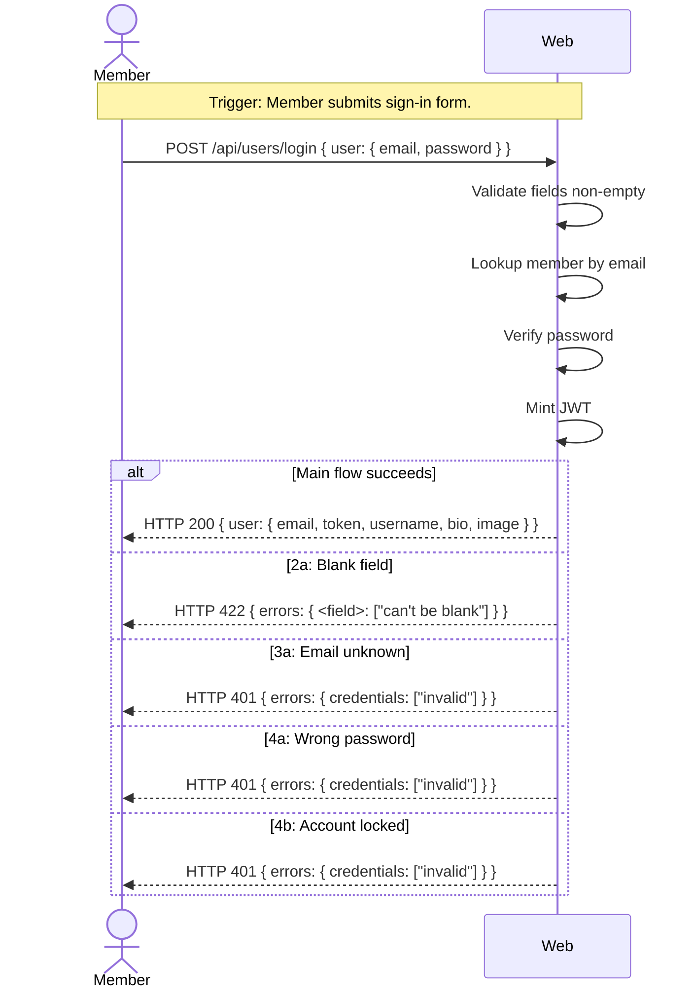

# UC-02 — Sign In

## Completeness level

- [ ] **Brief**
- [ ] **Casual**
- [x] **Fully Dressed** — mandatory Postconditions for every scenario.

## Operational principle

A Member who already has an account provides their email and password. The system looks up the account by email, verifies the password, and returns a JSON Web Token plus the Member's profile (username, email, bio, image). If the email is unknown or the password is wrong, the system returns a 401 error without revealing which field is incorrect. If the input is malformed (blank email or password), the system returns a 422 validation error.

## Actors

- **Member** — an authenticated user who wants to sign in to an existing account

## Scenarios

### Scenario: sign-in

- **Trigger:** Member submits the sign-in form with email and password.
- **Pre-conditions:**
  - A Member account exists with the given email.
  - The account has a stored password credential.
  - The account is not locked due to failed attempts.
- **Main flow:**
  1. Member sends email and password to the system.
  2. System validates that email and password are present and non-empty.
  3. System looks up the Member by email.
  4. System verifies the password against the stored credential.
  5. System mints a JWT session token for the Member.
  6. System responds with HTTP 200 and the user object (email, token, username, bio, image).
- **Expected outcomes:**
  - A valid JWT token is returned.
  - The response includes the Member's profile (username, email, bio, image).
- **Postconditions — Success:**
  - A `Session` entity is created linking the Member to a JWT token.
  - `PasswordAuth.failedAttempts` is reset to 0 (if it was non-zero).
- **Postconditions — Failure:**
  - If the flow terminates at any extension below, **no token is minted**. If the email or password are blank, no state is modified. If the email is unknown or the password is wrong, `PasswordAuth.failedAttempts` is incremented (if the user exists) but no session is created.

- **Extensions:**
  - **2a.** Email or password is blank:
      1. System identifies the blank field(s).
      2. System responds with HTTP 422 and error body `{"errors": {"<field>": ["can't be blank"]}}`.
      - Postconditions — Success: N/A (extension terminates in failure).
      - Postconditions — Failure: No state is modified.
  - **3a.** Email is not registered:
      1. System detects no user exists with the given email.
      2. System responds with HTTP 401 and error body `{"errors": {"credentials": ["invalid"]}}`.
      - Postconditions — Success: N/A (extension terminates in failure).
      - Postconditions — Failure: No state is modified (no user found to increment attempts on).
  - **4a.** Password is wrong:
      1. System detects password does not match the stored credential.
      2. System increments `PasswordAuth.failedAttempts`.
      3. If `failedAttempts` reaches threshold (5), system locks the account for 15 minutes.
      4. System responds with HTTP 401 and error body `{"errors": {"credentials": ["invalid"]}}`.
      - Postconditions — Success: N/A (extension terminates in failure).
      - Postconditions — Failure: `PasswordAuth.failedAttempts` is incremented. `PasswordAuth.lockedUntil` may be set. No session is created.
  - **4b.** Account is locked:
      1. System detects the account is temporarily locked.
      2. System responds with HTTP 401 and error body `{"errors": {"credentials": ["invalid"]}}`.
      - Postconditions — Success: N/A.
      - Postconditions — Failure: No state is modified (lockedUntil already set).

- **Interaction sketch:**

## Out of scope

- Registration — already covered by UC-01.
- Password reset — not part of the Conduit spec.
- Logout — tokens are stateless JWT; the Conduit API has no logout endpoint.

## Relationship to other use cases

- **UC-01-register** — depends on registered accounts existing.
- **UC-03-manage-profile** — depends on the JWT token from sign-in.
