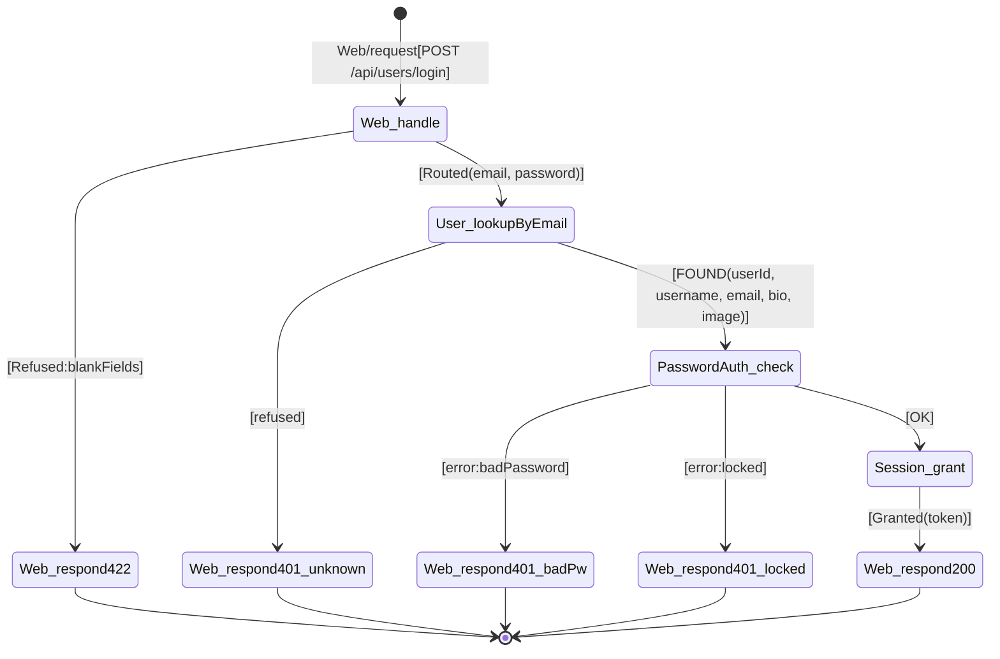

# Chain table — sign-in

## Scenario

`sign-in` — Member submits the sign-in form with email and password.

## Chain

| # | When | Then | Inputs | Outcome | Why this step |
|---|---|---|---|---|---|
| 1 | `Web/request[POST /api/users/login]` | `Web.handle` | route, body `{email, password}` | `Routed(email, password)` \| `Refused:blankFields` | HTTP entry point (R4); validates request body is parseable and required fields present. |
| 2 | `Web.handle[Refused:blankFields]` | `Web.respond[422]` | `{errors: {<field>: ["can't be blank"]}}` | `Sent` | Blank field detected — return validation error. |
| 3 | `Web.handle[Routed(email, password)]` | `User.lookupByEmail` | email | `FOUND(userId, username, email, bio, image)` \| `refused` | Look up Member by email. |
| 4 | `User.lookupByEmail[FOUND(userId, username, email, bio, image)]` | `PasswordAuth.check` | userId, password | `OK` \| `error:badPassword` \| `error:locked` | Verify password. |
| 5 | `User.lookupByEmail[refused]` | `Web.respond[401]` | `{errors: {credentials: ["invalid"]}}` | `Sent` | Unknown email — non-enumerating 401. |
| 6 | `PasswordAuth.check[OK]` | `Session.grant` | userId | `Granted(token)` | Mint JWT session token. |
| 7 | `PasswordAuth.check[error:badPassword]` | `Web.respond[401]` | `{errors: {credentials: ["invalid"]}}` | `Sent` | Wrong password — non-enumerating 401. |
| 8 | `PasswordAuth.check[error:locked]` | `Web.respond[401]` | `{errors: {credentials: ["invalid"]}}` | `Sent` | Account locked — non-enumerating 401. |
| 9 | `Session.grant[Granted(token)]` | `Web.respond[200]` | `{user: {email, token, username, bio, image}}` | `Sent` | Return success with user profile and JWT. |

## Diagram

## Cross-checks

- Every concept in the table (`Web`, `User`, `PasswordAuth`, `Session`) is listed in `../02a_responsibility-map/output/responsibility-map.md`.
- The first row is `Web/request → Web.handle` (R4); the last rows are `... → Web.respond[...]`.
- The trigger (`POST /api/users/login`) and final responses (200 with user, 401 with error, 422 with validation) match the use case's Trigger and Expected outcomes.
- All four extensions (blank field, unknown email, wrong password, locked) are represented.
- Each `<Concept>.<action>` pair appears at most once as a `Then` target.

## Notes

- `User.lookupByEmail` is a new action (not in UC-00). It returns `FOUND` with the user's profile fields so downstream syncs can assemble the response without additional concept-state reads.
- Rows 5, 7, and 8 all produce HTTP 401 with the same response body `{"errors": {"credentials": ["invalid"]}}`. This is intentional — the Conduit spec requires non-enumerating error responses that don't reveal whether the email exists.
- Row 9 (`Web.respond[200]`) needs `userId` from the FOUND outcome, `token` from the Session.grant outcome, and `username`/`email`/`bio`/`image` from the FOUND outcome. Carried fields are declared explicitly on the trigger contracts.
