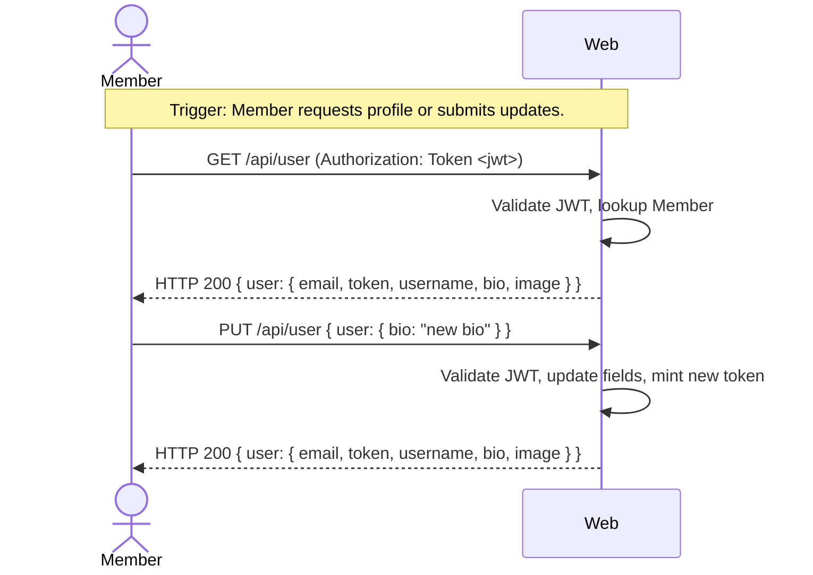

# UC-03 — Manage Profile

## Completeness level

- [ ] **Brief**
- [ ] **Casual**
- [x] **Fully Dressed**

## Operational principle

A signed-in Member can retrieve their own profile (email, username, bio, image, token) and update any combination of their profile fields. The system validates uniqueness for email and username changes, and enforces password strength (minimum 8 characters). Successful updates return the refreshed profile with a new JWT token.

## Actors

- **Member** — authenticated user who wants to view or update their profile

## Scenarios

### Scenario: view-profile

- **Trigger:** Member requests their current profile.
- **Pre-conditions:**
  - Member has a valid JWT session token.
  - A Member account exists.
- **Main flow:**
  1. Member sends GET /api/user with their JWT token.
  2. System validates the session token and identifies the Member.
  3. System looks up the Member's profile (username, email, bio, image).
  4. System responds with HTTP 200 and the user object including a refreshed JWT token.
- **Expected outcomes:**
  - The response includes the Member's current profile fields and a JWT token.
- **Postconditions — Success:**
  - A new `Session` entity may be minted (token rotation). No persistent state is changed.
- **Postconditions — Failure:**
  - If the token is missing or invalid: HTTP 401, `{"errors": {"token": ["is missing"]}}`. No state is modified.

### Scenario: update-profile

- **Trigger:** Member submits updated profile fields.
- **Pre-conditions:**
  - Member has a valid JWT session token.
  - At least one field to update is provided.
- **Main flow:**
  1. Member sends PUT /api/user with updated fields (any of: email, username, bio, image, password).
  2. System validates the session token.
  3. System validates that email and username (if provided) are non-empty and not already taken.
  4. System validates that password (if provided) is at least 8 characters.
  5. System updates the Member's profile fields.
  6. System mints a new JWT session token.
  7. System responds with HTTP 200 and the updated user object with new token.
- **Expected outcomes:**
  - The profile fields are updated in the system.
  - A new JWT token is returned.
- **Postconditions — Success:**
  - `User` state is updated for the fields provided.
  - A new `Session` entity is created (token rotation).
- **Postconditions — Failure:**
  - If the token is missing: HTTP 401, no state modified.
  - If email/username is blank or null: HTTP 422, no state modified.
  - If email/username is already taken: HTTP 422 (Conduit spec uses 422 for conflicts on update).
  - If password is too short (<8): HTTP 422, no state modified.

- **Extensions:**
  - **3a.** Email or username is blank/null:
      1. System detects blank value.
      2. System responds with HTTP 422.
      - Postconditions — Failure: No state is modified.
  - **3b.** Email or username already taken:
      1. System detects duplicate.
      2. System responds with HTTP 422.
      - Postconditions — Failure: No state is modified.
  - **4a.** Password shorter than 8 characters:
      1. System detects insufficient length.
      2. System responds with HTTP 422.
      - Postconditions — Failure: No state is modified.
  - **4b.** Empty password or null:
      1. System detects empty/null value.
      2. System responds with HTTP 422.
      - Postconditions — Failure: No state is modified.

- **Interaction sketch:**

## Out of scope

- Registration — UC-01.
- Sign in — UC-02.
- Profile viewing by other users — UC-04 (View Profile).
- Password reset — not in Conduit spec.

## Relationship to other use cases

- **UC-01-register** — depends on a registered account.
- **UC-02-sign-in** — depends on valid JWT from sign-in.
- **UC-04-view-profile** — viewing other users' profiles is a separate use case.
