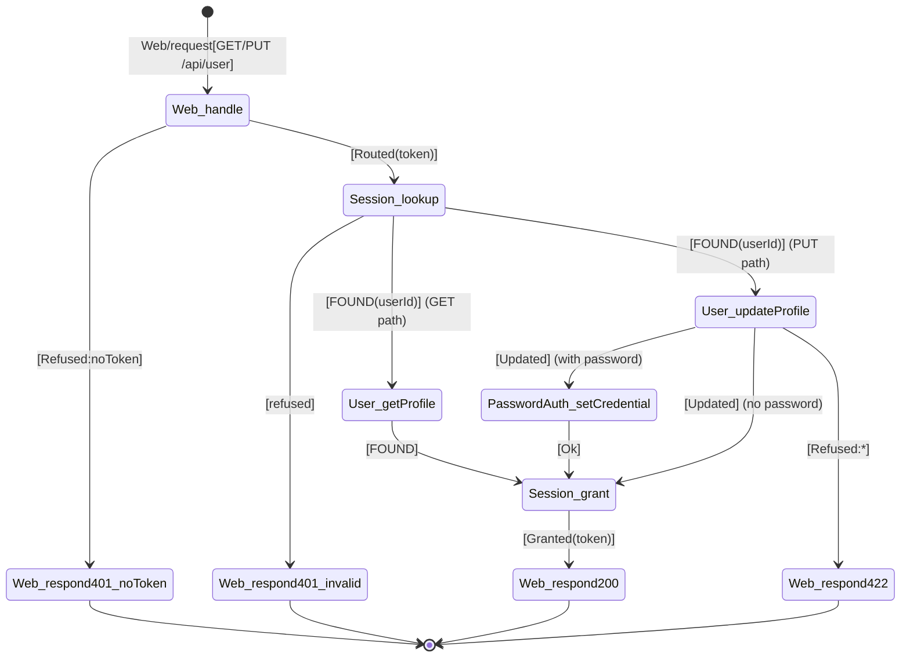

# Chain table — manage-profile (view + update)

## Scenario

`manage-profile` — Member views or updates their profile.

## Chain — view-profile

| # | When | Then | Inputs | Outcome | Why this step |
|---|---|---|---|---|---|
| 1 | `Web/request[GET /api/user]` | `Web.handle` | route, token header | `Routed(token)` \| `Refused:noToken` | HTTP entry point (R4); validates token header present. |
| 2 | `Web.handle[Refused:noToken]` | `Web.respond[401]` | `{errors: {token: ["is missing"]}}` | `Sent` | Missing token — return auth error. |
| 3 | `Web.handle[Routed(token)]` | `Session.lookup` | token | `FOUND(userId)` \| `refused` | Validate JWT and resolve userId. |
| 4 | `Session.lookup[refused]` | `Web.respond[401]` | `{errors: {token: ["is invalid"]}}` | `Sent` | Invalid/expired token. |
| 5 | `Session.lookup[FOUND(userId)]` | `User.getProfile` | userId | `FOUND(username, email, bio, image)` | Look up user profile data. |
| 6 | `User.getProfile[FOUND]` | `Session.grant` | userId | `Granted(token)` | Mint new JWT (token rotation). |
| 7 | `Session.grant[Granted(token)]` | `Web.respond[200]` | `{user: {email, token, username, bio, image}}` | `Sent` | Return profile with refreshed token. |

## Chain — update-profile

| # | When | Then | Inputs | Outcome | Why this step |
|---|---|---|---|---|---|
| 1 | `Web/request[PUT /api/user]` | `Web.handle` | route, token header, body `{email, username, bio, image, password}` | `Routed(token, fields)` \| `Refused:noToken` | HTTP entry point; validates token and parses body. |
| 2 | `Web.handle[Refused:noToken]` | `Web.respond[401]` | `{errors: {token: ["is missing"]}}` | `Sent` | Missing token. |
| 3 | `Web.handle[Routed(token, fields)]` | `Session.lookup` | token | `FOUND(userId)` \| `refused` | Validate session. |
| 4 | `Session.lookup[refused]` | `Web.respond[401]` | `{errors: {token: ["is invalid"]}}` | `Sent` | Invalid token. |
| 5 | `Session.lookup[FOUND(userId)]` | `User.updateProfile` | userId, email?, username?, bio?, image? | `Updated` \| `Refused:duplicateEmail` \| `Refused:duplicateUsername` \| `Refused:blankField` | Update profile fields if valid. |
| 6 | `User.updateProfile[Updated]` | `PasswordAuth.setCredential` | userId, password | `Ok` \| (skip if no password change) | Update password if provided. |
| 7 | `User.updateProfile[Refused:*]` | `Web.respond[422]` | `{errors: {<field>: ["message"]}}` | `Sent` | Validation error. |
| 8 | `PasswordAuth.setCredential[Ok]` / `User.updateProfile[Updated] (no password)` | `Session.grant` | userId | `Granted(token)` | Mint new JWT. |
| 9 | `Session.grant[Granted(token)]` | `Web.respond[200]` | `{user: {email, token, username, bio, image}}` | `Sent` | Return updated profile. |

## Diagram

## Cross-checks

- Every concept in the table (`Web`, `Session`, `User`, `PasswordAuth`) is listed in the responsibility map.
- First row is `Web/request → Web.handle` (R4); last rows are `... → Web.respond[...]`.
- Each `<Concept>.<action>` pair appears at most once as a `Then` target.

## Notes

- `User.getProfile` is a new action (different from `lookupByEmail`/`lookupByUsername`) that returns profile fields for a given userId.
- `User.updateProfile` is a new action that accepts partial updates and validates uniqueness for email/username changes.
- The GET path (view-profile) and PUT path (update-profile) share rows 1–4 and differ after `Session.lookup`.
- Token rotation: each profile access or update mints a new JWT. The Conduit spec returns `token` on every `/api/user` response.
