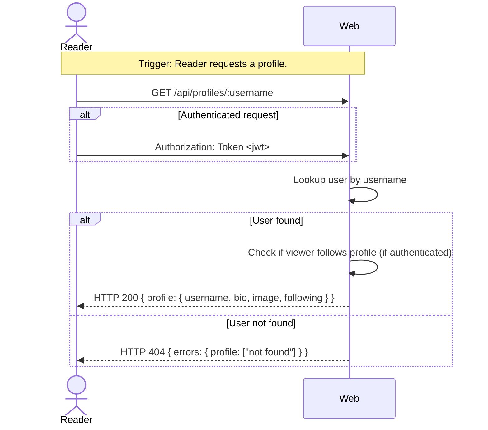

# UC-04 — View Profile

## Completeness level

- [ ] **Brief**
- [ ] **Casual**
- [x] **Fully Dressed**

## Operational principle

A Reader (who may or may not be authenticated) can view any Member's public profile by username. The system returns the profile's username, bio, and image, plus a dynamic `following` boolean that indicates whether the viewing Reader (if authenticated) follows that profile. If the username does not exist, the system returns a 404 error.

## Actors

- **Reader** — anyone browsing profiles; may be unauthenticated or an authenticated Member

## Scenarios

### Scenario: view-profile

- **Trigger:** Reader requests a profile by username.
- **Pre-conditions:**
  - A Member account exists with the given username (for success case).
- **Main flow:**
  1. Reader sends GET /api/profiles/:username (optionally with JWT token if authenticated).
  2. System looks up the Member by username.
  3. System checks if the requesting Reader (if authenticated) follows this profile.
  4. System responds with HTTP 200 and the profile object including the `following` flag.
- **Expected outcomes:**
  - The response includes `username`, `bio`, `image`, and `following`.
  - `following` is `true` when the authenticated Reader follows the profile.
  - `following` is `false` when the Reader is unauthenticated or does not follow.
- **Postconditions — Success:**
  - No persistent state is modified.
- **Postconditions — Failure:**
  - If the username is not found: HTTP 404, `{"errors": {"profile": ["not found"]}}`. No state is modified.

- **Extensions:**
  - **3a.** Username not found:
      1. System detects no user with the given username.
      2. System responds with HTTP 404.
      - Postconditions — Failure: No state is modified.
  - **3b.** Reader is not authenticated (no JWT token):
      1. System proceeds without a follower check.
      2. System responds with HTTP 200 and `following: false`.
      - Postconditions — Success: No state is modified (read-only).
  - **3c.** Reader is authenticated but does not follow:
      1. System validates the token.
      2. System finds the user does not follow the profile.
      3. System responds with HTTP 200 and `following: false`.
      - Postconditions — Success: No state is modified (read-only).

- **Interaction sketch:**

## Out of scope

- Viewing own profile — covered by UC-03 (Manage Profile).
- Updating profile — covered by UC-03.
- Follow/unfollow — covered by UC-11 (Follow User).

## Relationship to other use cases

- **UC-03-manage-profile** — own profile retrieval is a separate use case.
- **UC-11-follow-user** — the `following` indicator depends on the follow relationship.
