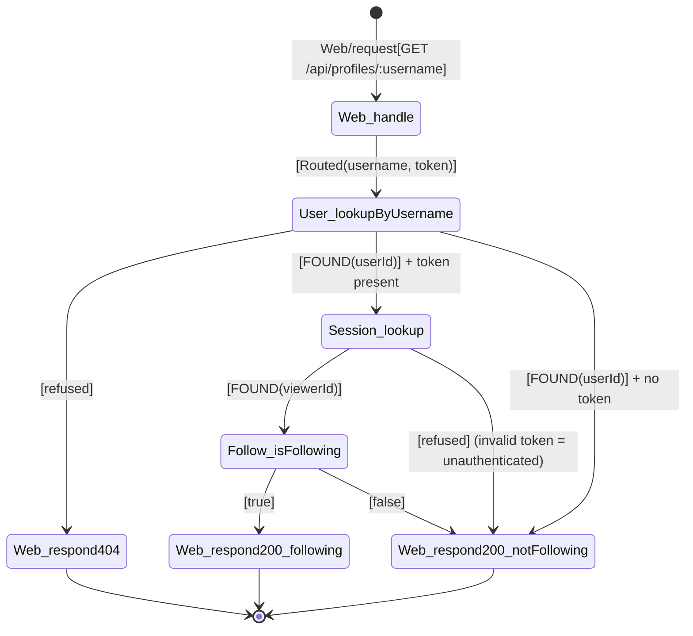

# Chain table — view-profile

## Scenario

`view-profile` — Reader requests a profile by username, optionally authenticated.

## Chain

| # | When | Then | Inputs | Outcome | Why this step |
|---|---|---|---|---|---|
| 1 | `Web/request[GET /api/profiles/:username]` | `Web.handle` | route, token (optional), username param | `Routed(username, token?)` | HTTP entry point (R4). Token is optional — if provided, viewer is authenticated. |
| 2 | `Web.handle[Routed(username, token)]` | `User.lookupByUsername` | username | `FOUND(userId)` \| `refused` | Look up the profile user. |
| 3 | `User.lookupByUsername[refused]` | `Web.respond[404]` | `{errors: {profile: ["not found"]}}` | `Sent` | Username not found. |
| 4 | `User.lookupByUsername[FOUND(userId)]` | (branch on auth) | — | — | Route to authenticated or unauthenticated path. |
| 5a | (authenticated) token present → `Session.lookup` | token | `FOUND(viewerId)` \| `refused` | Validate viewer's token. |
| 5b | (unauthenticated) no token | `Web.respond[200]` | `{profile: {username, bio, image, following: false}}` | `Sent` | Unauthenticated — following is false. |
| 6a | `Session.lookup[FOUND(viewerId)]` | `Follow.isFollowing` | viewerId, profileUserId | `true` \| `false` | Check follow relationship. |
| 7a | `Follow.isFollowing[true]` | `Web.respond[200]` | `{profile: {username, bio, image, following: true}}` | `Sent` | Viewer follows the profile. |
| 7b | `Follow.isFollowing[false]` | `Web.respond[200]` | `{profile: {username, bio, image, following: false}}` | `Sent` | Viewer does not follow the profile. |

## Diagram

## Cross-checks

- Every concept (`Web`, `User`, `Session`, `Follow`) is in the responsibility map.
- First row is `Web/request → Web.handle` (R4); last rows are `... → Web.respond[...]`.
- Each `<Concept>.<action>` pair appears at most once as a `Then` target.
- Auth is optional: the chain branches after user lookup depending on token presence.

## Notes

- `Follow.isFollowing` is a new action that returns boolean. It is owned by the `Follow` concept which will be fully implemented in UC-11.
- Invalid/expired tokens are treated as unauthenticated (row 5a Session.lookup[refused] → 5b path).
- The profile data (username, bio, image) comes from `User.lookupByUsername` — this action may need to return profile fields in addition to userId.
