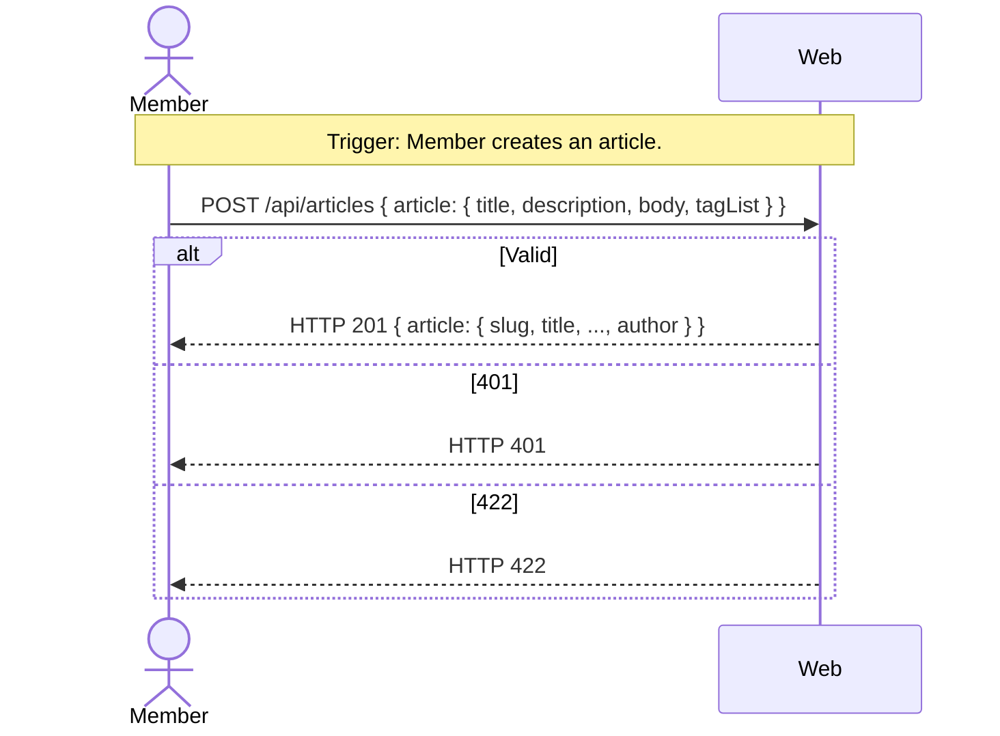

# UC-05 — Manage Articles

## Completeness level

- [ ] **Brief**
- [ ] **Casual**
- [x] **Fully Dressed**

## Operational principle

A signed-in Member can create, update, and delete their own articles. Creating an article requires a title, description, body, and optional tag list. The system generates a unique slug from the title. Only the article's author can update or delete it. Successful creation returns HTTP 201 with the full article; updates return 200; deletion returns 204.

## Actors

- **Member** — authenticated article author

## Scenarios

### Scenario: create-article

- **Trigger:** Member submits a new article with title, description, body, and optional tags.
- **Pre-conditions:**
  - Member has a valid JWT session token.
  - Title is non-empty and unique (after slug generation).
- **Main flow:**
  1. Member sends POST /api/articles with title, description, body, and optional tagList.
  2. System validates the session token and identifies the author.
  3. System validates the title is non-empty.
  4. System generates a unique slug from the title.
  5. System creates the article with the author's userId, generated slug, and current timestamps.
  6. System stores any provided tags.
  7. System responds with HTTP 201 and the article object including author profile.
- **Expected outcomes:**
  - An article exists in the system with a unique slug.
  - The article has `favorited: false` and `favoritesCount: 0`.
  - The response includes the nested author profile.
- **Postconditions — Success:**
  - A new `Article` entity is persisted with slug, title, description, body, authorId, createdAt, updatedAt.
  - `Tag` entities are created for each tag in tagList.
  - The slug is derived from the title and is unique.
- **Postconditions — Failure:**
  - If title is blank: HTTP 422, no state modified.
  - If token is missing/invalid: HTTP 401, no state modified.

- **Extensions:**
  - **2a.** Token missing or invalid:
      1. System responds with HTTP 401.
      - Postconditions — Failure: No state modified.
  - **3a.** Title is blank:
      1. System responds with HTTP 422.
      - Postconditions — Failure: No state modified.

- **Interaction sketch:**

### Scenario: update-article

- **Trigger:** Member updates an existing article they authored.
- **Main flow:**
  1. Member sends PUT /api/articles/:slug with updated fields.
  2. System validates the session token.
  3. System looks up the article by slug.
  4. System verifies the Member is the article's author.
  5. System updates the article fields and updatedAt timestamp.
  6. System responds with HTTP 200 and the updated article.
- **Expected outcomes:** Article fields are updated; slug remains unchanged.
- **Extensions:**
  - **3a.** Article not found: HTTP 404.
  - **4a.** Not the author: HTTP 403.
  - **4b.** Validation error (blank title): HTTP 422.

### Scenario: delete-article

- **Trigger:** Member deletes an article they authored.
- **Main flow:**
  1. Member sends DELETE /api/articles/:slug with JWT.
  2. System validates token, looks up article, verifies ownership.
  3. System deletes the article.
  4. System responds with HTTP 204 (no content).
- **Expected outcomes:** Article is removed from the system.
- **Extensions:**
  - Article not found: HTTP 404.
  - Not the author: HTTP 403.

## Out of scope

- Reading/favoriting articles — separate use cases.
- Commenting on articles — UC-08/09.

## Relationship to other use cases

- UC-02-sign-in: depends on valid JWT.
- UC-06-browse-articles: lists articles created here.
- UC-07-read-article: reads articles created here.
- UC-10-favorite-article: favorites articles created here.
