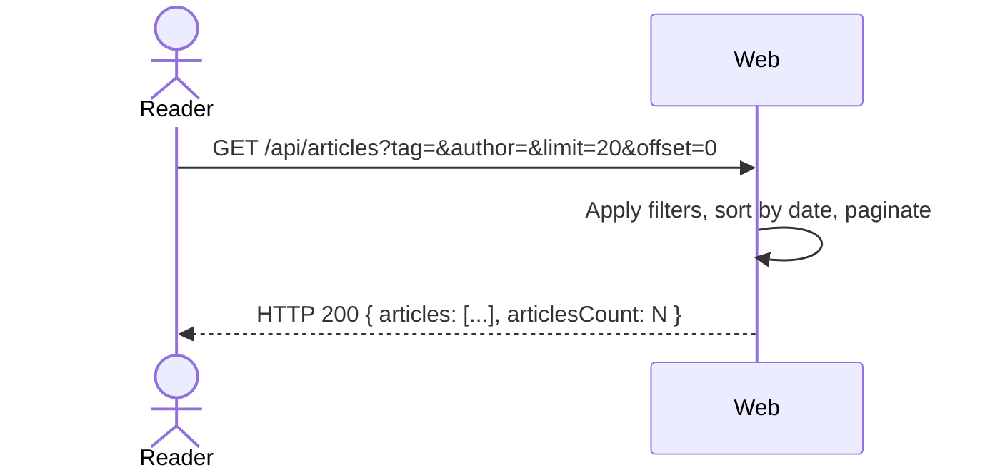

# UC-06 — Browse Articles

## Completeness level

- [ ] **Brief**
- [ ] **Casual**
- [x] **Fully Dressed**

## Operational principle

A Reader can discover articles by filtering by tag, author, or favorited status, with pagination (limit/offset) sorted by most recent. Results include the article metadata and author profile. If the Reader is authenticated, their favorited status and following status are reflected.

## Actors

- **Reader** — anyone browsing articles; may be unauthenticated or authenticated

## Scenarios

### Scenario: browse-articles

- **Trigger:** Reader requests a list of articles with optional filters.
- **Pre-conditions:** Articles exist in the system (for non-empty results).
- **Main flow:**
  1. Reader sends GET /api/articles with optional query params: tag, author, favorited, limit, offset.
  2. System applies filters (tag, author, favorited).
  3. System sorts by most recent (createdAt descending).
  4. System applies pagination (limit/offset).
  5. System returns HTTP 200 with articles array and total count.
- **Expected outcomes:**
  - Articles are sorted by most recent first.
  - Each article includes author profile with username, bio, image, following.
  - `favorited` and `following` reflect the authenticated Reader's relationship (false if unauthenticated).
  - Response includes `articlesCount` for pagination.
- **Postconditions — Success:** No persistent state is modified.
- **Postconditions — Failure:** No state is modified.

- **Extensions:**
  - **2a.** No matching articles (empty result):
      1. System returns HTTP 200 with empty articles array and articlesCount: 0.
  - **2b.** Invalid pagination params:
      1. System applies defaults (limit=20, offset=0).

- **Interaction sketch:**

## Out of scope

- Creating articles — UC-05-manage-articles.
- Reading a single article — UC-07-read-article.
- Favoriting — UC-10-favorite-article.

## Relationship to other use cases

- **UC-05-manage-articles** — articles listed here are created there.
- **UC-07-read-article** — individual article reading.
- **UC-10-favorite-article** — the `favorited` field depends on favorites data.
