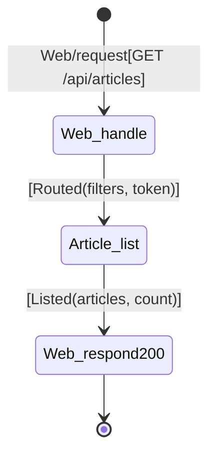

# Chain table — browse-articles

## Scenario

`browse-articles` — Reader requests articles with optional filters, pagination.

## Chain

| # | When | Then | Inputs | Outcome | Why this step |
|---|---|---|---|---|---|
| 1 | `Web/request[GET /api/articles]` | `Web.handle` | route, query params `{tag?, author?, favorited?, limit, offset}`, token? | `Routed(filters, token?)` | HTTP entry; parses query params. Token optional. |
| 2 | `Web.handle[Routed(token?, filters)]` | `Article.list` | tag?, author?, favorited?, limit, offset | `Listed(articles, count)` | Query articles with filters + pagination. |
| 3 | `Article.list[Listed]` | (for each article) resolve author profile, check favorited if authenticated | — | — | Enrich each article with author + favorite status. |
| 4 | (after enrichment) | `Web.respond[200]` | `{articles: [...], articlesCount: N}` | `Sent` | Return paginated results. |

## Diagram

## Cross-checks

- Every concept (`Web`, `Article`, `User`, `Favorite`) is in the responsibility map.
- First row is `Web/request → Web.handle` (R4); last row is `Web.respond[200]`.
- Pagination defaults: limit=20, offset=0.
- Auth optional — token may be absent.
