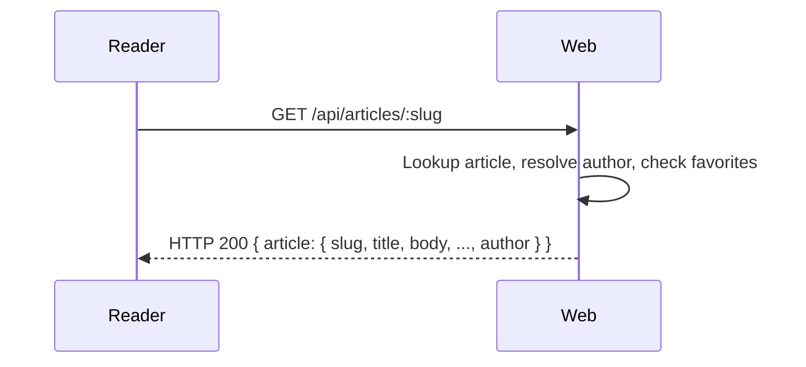

# UC-07 — Read Article

## Completeness level

- [x] **Fully Dressed**

## Operational principle

A Reader can view a single article's full details by slug. The response includes the article body, metadata, tag list, timestamps, favorite count, and the author's profile with following status. Auth is optional — if authenticated, the Reader's favorited and following status is reflected.

## Actors

- **Reader** — anyone reading an article; may be unauthenticated or authenticated

## Scenarios

### Scenario: read-article

- **Trigger:** Reader requests an article by slug.
- **Pre-conditions:** An article with the given slug exists (for success).
- **Main flow:**
  1. Reader sends GET /api/articles/:slug (optionally with JWT).
  2. System looks up the article by slug.
  3. System resolves the author profile.
  4. System checks favorited/following status if authenticated.
  5. System responds with HTTP 200 and the full article object.
- **Expected outcomes:** Full article with author profile, favorited/following status.
- **Postconditions — Success:** No state modified.
- **Postconditions — Failure:** HTTP 404 if slug not found.

- **Interaction sketch:**

## Out of scope
- Listing articles — UC-06.
- Creating/updating — UC-05.
