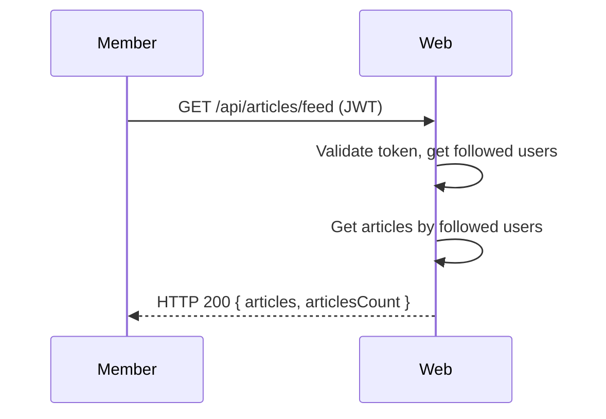

# UC-12 — View Feed

## Operational principle
A signed-in Member can view a paginated feed of articles published by users they follow, sorted by most recent. Auth is required. Results include article metadata, author profile, and favorite status.

## Scenario: view-feed
- **Trigger:** Member requests their feed.
- **Pre-conditions:** Member has a valid JWT. Some followed users may have articles.
- **Main flow:**
  1. Member sends GET /api/articles/feed?limit=20&offset=0 with JWT.
  2. System validates token, identifies the Member.
  3. System retrieves the list of users the Member follows.
  4. System retrieves articles by followed users, sorted by most recent.
  5. System responds with HTTP 200 and articles array with count.
- **Extensions:**
  - **2a.** Invalid/missing token: HTTP 401.
  - **3a.** No followed users: returns empty articles array.
- **Interaction sketch:**

