<!-- Template for consolidated chain (derived from Stage 02b per-scenario chains). Purpose: supplemental implementation safety view showing all scenario outcomes in one branching table and FSM diagram. This artefact is non-canonical; per-scenario chain files remain authoritative. -->

# Consolidated chain — `<use-case-name>`

> **Status: Derived, non-canonical view.** This file consolidates all scenarios from the per-scenario chain files into a single branching table and finite state machine diagram. It aids implementation review (Stages 03–04) by showing complete outcome coverage at a glance. The per-scenario `<scenario>-chain.md` files remain canonical for traceability to the use case.
>
> When the use case has 2+ scenarios, generate this file alongside (not instead of) the per-scenario chains.

## Scenarios covered

- `<scenario-1-name>` (main flow)
- `<scenario-2-name>` (error path)
- `<scenario-3-name>` (error path)
- …

## Consolidated chain

| # | Scenario(s) | When | Then | Inputs | Outcome | Why this path |
|---|---|---|---|---|---|---|
| 1 | all | `Web/request[<route>]` | `Web.handle` | `<route>`, `<request body>` | `Routed` | Entry point (R4) |
| 2 | main, scenario-X | `Web.handle[Routed]` | `<Concept1>.<action1>` | `<args>` | `<outcome>` | Happy path continuation |
| 2a | scenario-Y | `<Concept1>.<action1>[<error>]` | `Web.respond[<status>]` | `<status>`, `<body>` | `Sent` | Short-circuit error |
| 3 | main | `<Concept1>.<action1>[<outcome>]` | `<Concept2>.<action2>` | `<args>` | `<outcome>` | Next step (happy path) |
| 3a | scenario-Z | `<Concept2>.<action2>[<error>]` | `Web.respond[<status>]` | `<status>`, `<body>` | `Sent` | Branch error |
| N | main | `<ConceptN>.<actionN>[<outcome>]` | `Web.respond[<status>]` | `<status>`, `<body>` | `Sent` | Terminal success |
| 90+ | errors | `<ConceptX>.<actionX>[<error>]` | `Web.respond[<status>]` | `<status>`, `<body>` | `Sent` | Terminal failure |

## WYSIWID lineage and Stage 03 derivation

This artefact stays in **Level 2b** even though it is designed to help
Stage 03 and Stage 04 work.

- The row's `Then` is the concrete rendering of the WYSIWID/Taste Tag
  **Then** column.
- The row's `When` is explicit so the reviewer can inspect the causal
  edge directly in Stage 02b.
- `Inputs` are the downstream action's implementation-facing arguments
  only. They are **not** Stage 03 `Where` provenance.
- Stage 03 is the first place where join provenance and pattern labels
  (`A/B/C/D`, `Where`, `Key`) are formalised.

Use this table to keep the causal choreography explicit without letting
Stage 02b collapse into a pseudo-sync specification.

## Reading the table as `When -> Then`

Read each non-root row as a derived causal rule:

- row 1: `Web/request -> Web.handle`
- every later row: `this row's explicit When -> this row's Then`

That is the exact bridge into Stage 03 sync authoring.

## State diagram (combined FSM)

> Consolidates all per-scenario state diagrams into one branching view. Shows success path, all failure branches, and all terminal states.

```mermaid
stateDiagram-v2
    [*] --> <Concept1_action1> : <trigger>
    <Concept1_action1> --> <Concept2_action2> : [ok]
    <Concept1_action1> --> Web_respond401 : [error:X]
    <Concept2_action2> --> <Concept3_action3> : [ok]
    <Concept2_action2> --> Web_respond404 : [error:Y]
    <Concept3_action3> --> Web_respond200 : [ok]
    <Concept3_action3> --> Web_respond422 : [error:Z]
    Web_respond200 --> [*]
    Web_respond401 --> [*]
    Web_respond404 --> [*]
    Web_respond422 --> [*]
```

## Implementation coverage checklist

Use this checklist when implementing Stages 03–04 to ensure no outcome is missed:

- [ ] Concept action outcome enum:
  - [ ] `<Concept1>.<action1>`: `[<outcome1>, <outcome2>, …]` ✓ matches the consolidated chain rows
  - [ ] `<Concept2>.<action2>`: `[<outcome1>, <outcome2>, …]` ✓ matches the consolidated chain rows
  - [ ] (repeat for all concepts)
- [ ] Sync rules:
  - [ ] One sync per non-root row ✓ root `Web.handle` is not a sync
  - [ ] All error syncs present ✓ every `[error:X]` has a sync to terminal response
  - [ ] No invented transitions ✓ only "When/Then" pairs from this table
- [ ] Flow tests (Stage 04c):
  - [ ] One test per distinct terminal outcome (e.g., 200, 401, 404, 422) ✓
  - [ ] All branches tested ✓ each `When → Then` path has ≥1 test
  - [ ] Rare paths not skipped ✓ (e.g., lockout, notFound even if only one scenario)

## Cross-check against per-scenario files

Validate that this consolidated view is consistent:

- Every row in this table can be traced back to a specific row in one of the per-scenario `<scenario>-chain.md` files.
- Every per-scenario file's final row (`Web/respond`) appears in this consolidated table (possibly merged if responses are identical).
- No outcome enum values are missing (compare against all per-scenario `Outcome` columns).

## Deriving Stage 03 syncs from this table

For each non-root row:

1. Derive the Stage 03 `then` from that row's `Then` token.
2. Derive the Stage 03 `when` from the row's explicit `When` token.
3. Add Stage 03 `where` bindings only for arguments in `Inputs` that are
  not already carried by the triggering outcome.

Stage 02b therefore answers **what action fires next**; Stage 03 adds
**where each argument came from**.
