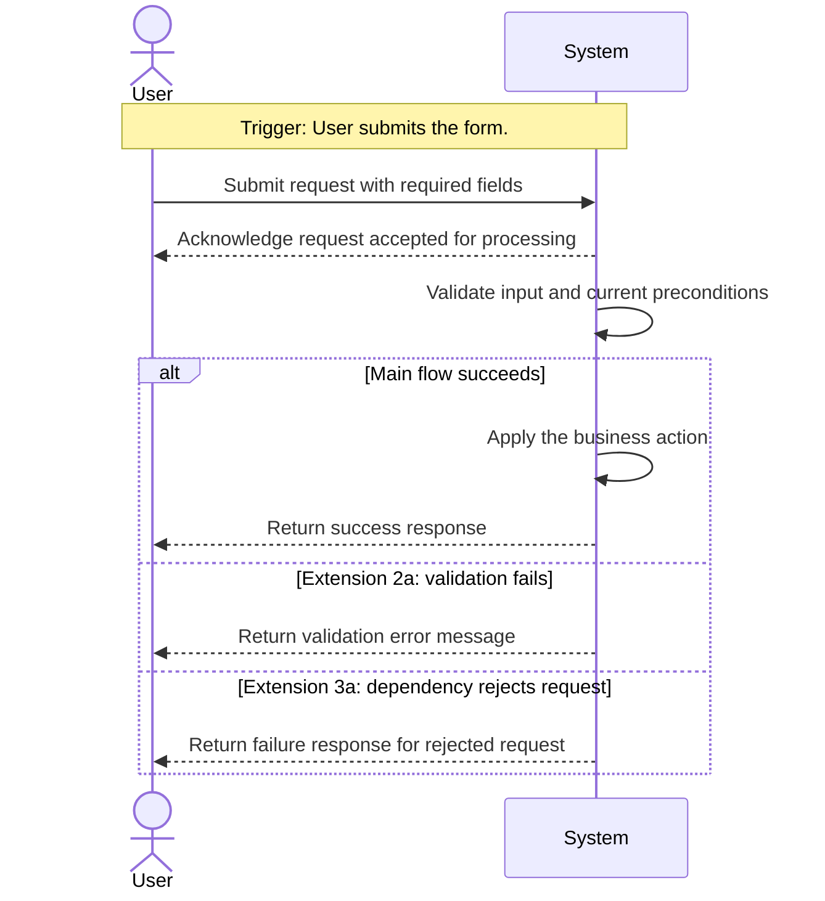

<!-- Template for Stage 01 (01_usecase). Purpose: see methodology/core/CLAD.md and methodology/implementation/STAGES.md §"Stage 01". -->

# UC-XX — <feature name>

## Completeness level

> Pick one. The level controls how much of this template you must fill
> in. Adapted from Cockburn's *Writing Effective Use Cases*.

- [ ] **Brief** — one paragraph. Use for out-of-scope or deferred goals
  that exist only to be referenced from elsewhere.
- [ ] **Casual** — operational principle + main scenario + key
  extensions. Default for backlog items not yet in active design.
- [ ] **Fully Dressed** — the entire template below, including
  mandatory **Postconditions** for every scenario. **Required** before
  a use case enters Stage 02a.

A use case is **promoted** to Fully Dressed at the moment its first
flow artefact is drafted (i.e. when Stage 02a starts). Do not
pre-emptively fully-dress use cases that are not in active design;
the unused detail rots.

A use case that is not yet Fully Dressed must not be used as input to
Stage 02a, 02b, 03, or any 04 sub-stage. The Fully Dressed gate is
load-bearing.

## Operational principle

> One paragraph describing the feature from a user's point of view:
> what they do, what they see, why they would use it.

## Actors

- **<PrimaryActor>** — <role>
- **<SecondaryActor>** — <role>  *(omit if none)*

## Scenarios

> Each scenario is a trigger + expected outcomes + **postconditions**.
> Name them; the names are referenced by chain tables (Stage 02b),
> syncs (Stage 03), and verification traces (Stage 05).

### Scenario: <name>

- **Trigger:** <user action or external event>
  *(Every scenario must state its trigger explicitly. Examples: "User clicks Submit", "Password-reset token expires", "System detects lockout condition".)*
- **Pre-conditions:**
  - <state required>
- **Main flow:**
  1. <Actor> does X. *(Step 1 must always be an action by the primary actor, never by the system.)*
  2. System responds with Y.
  3. …

  > **Note:** Domain entities (e.g. "Loan", "Copy", "Title") are not actors. Actors are roles (e.g. "Patron", "Librarian", "Web User")
- **Expected outcomes:**
  - <observable outcome 1>
  - <observable outcome 2>
- **Postconditions — Success:**
  - <what is true after the main flow completes successfully>
  - <what state is modified, by which concept>
- **Postconditions — Failure:**
  - <what is true after any extension that ends in failure>
  - <if no state is modified, state that explicitly>

> **Extension format.** Each extension is: the step number it branches from, the branch condition, a numbered list of system responses, and Postconditions — Success/Failure for that branch only. Extensions do not repeat Trigger, Pre-conditions, Main flow, or Expected outcomes — those fields belong only on top-level `### Scenario:` blocks. If an extension fully resolves and resumes the main flow, note the resume point.

- **Extensions:**
  - **2a.** <condition detected at step 2>:
    1. System does X.
    2. System does Y.
    - Postconditions — Success: <what is true if the branch is handled correctly>
    - Postconditions — Failure: <what is true if the branch is not handled correctly>
  - **3a.** <condition detected at step 3>:
    1. System does X.
    - Postconditions — Success: <what is true if the branch is handled correctly>
    - Postconditions — Failure: <what is true if the branch is not handled correctly>

- **Interaction sketch (optional):**

  > **Diagram type: `sequenceDiagram` only.** This is a human-facing,
  > derived view of actor/system interaction at Stage 01. It is
  > explanatory only: the prose scenario remains canonical. If the prose
  > and the diagram disagree, the prose wins.
  >
  > Keep participants limited to the primary actor, any real supporting
  > actor, and `System` or `Web`. Do **not** introduce concept names,
  > sync names, provenance details, storage/state claims, or extra steps
  > that are not already present in the scenario text.
  >
  > Use one diagram per scenario. Derive it only from the scenario's
  > Trigger, Main flow, and Extensions. Validate at
  > [mermaid.live](https://mermaid.live) before committing.

  > **Translation rules.**
  > - The first message comes from the primary actor and mirrors the
  >   `Trigger` / Main flow step 1.
  > - Use `System` (or `Web` when HTTP is important) as the system-side
  >   participant unless a real external actor is named in the prose.
  > - `alt` / `else` blocks mirror scenario extensions; label them with
  >   the extension id (`2a`, `3a`, ...) and condition.
  > - Keep response messages user-observable. Do not smuggle in concept
  >   choreography; that belongs in Stage 02b chain tables.
  > - If you cannot draw the diagram without inventing details, omit it.

> **Both Postconditions sub-sections are mandatory in every Fully
> Dressed scenario.** A scenario without a Failure postcondition (even
> if it reads *"No state is modified"*) is incomplete and will be
> rejected at the Stage 01 gate.
>
> **Why mandatory.** Postconditions are what Stage 04c flow tests
> assert against. Each Success postcondition becomes one or more flow
> assertions; each Failure postcondition becomes a failure-branch
> assertion. Skipping them means the flow tests get invented during
> 04c instead of derived — which silently drifts the tests from the
> use case.

> **When to add a new scenario vs an extension.** A top-level scenario
> requires a genuinely distinct trigger and a genuinely distinct user
> goal. Failure branches — invalid input, duplicate submission,
> unauthorised state, resource not found — share the same trigger as
> the success path and belong in the `Extensions` field of that
> scenario, not as separate `### Scenario:` blocks. If two scenarios
> have the same trigger, one of them is an extension.
>
> **Naming rule for downstream derivation.** Name a top-level scenario
> for the user goal or trigger, not just for the happy-path outcome.
> Stage 02b derives one chain file from one top-level scenario, and that
> chain file includes the scenario's main flow **and** its extensions as
> distinct branches. Prefer names like `register-member` or
> `submit-registration`, not `successful-registration`, unless the use
> case truly has no failure extensions.
>
> **Identical postconditions are always wrong.** If Postconditions —
> Success and Postconditions — Failure contain the same content, one of
> them is incorrect. They must be distinct: Success postconditions
> describe state after the main flow completes; Failure postconditions
> describe state after an extension that ends in failure.

### Scenario: <name>

- **Trigger:** …
- **Pre-conditions:** …
- **Main flow:** …
- **Expected outcomes:** …
- **Postconditions — Success:** …
- **Postconditions — Failure:** …

## Out of scope

> What this feature explicitly does *not* cover. As important as what
> it does cover.

- <item>

## Relationship to other use cases

> Optional. Cite by `UC-id` and explain the relationship in one line.

- **UC-YY** — <how this use case relates>
